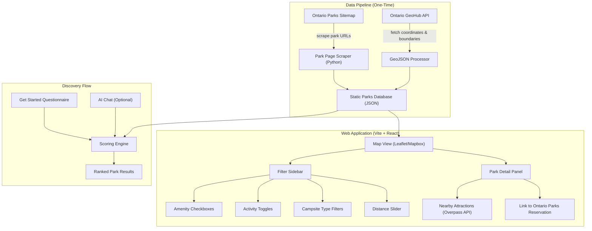

# Ontario Parks Searcher — Implementation Plan

A discovery and planning tool that dismantles the fragmented Ontario Parks experience and reassembles it into something *efficient*. Users will be able to filter, explore, compare, and plan trips to Ontario Parks without bouncing between dozens of tabs.

## The Problem (What We're Solving)

1. **No cross-park discovery** — To compare parks, you must click into each one individually
2. **No amenity filtering** — Can't say "show me parks with canoeing + electric sites" in one view
3. **No nearby attractions** — No way to know what towns, beaches, hikes, or events are near a park
4. **No smart recommendations** — No "what kind of trip are you looking for?" flow
5. **Distance is a separate lookup** — No sense of how far each park is from you

## User Review Required

> [!IMPORTANT]
> **Form Factor Decision**: Based on your description, I'm recommending a **web application** (Vite + React). This gives us the best foundation for:
> - Interactive map with filterable markers
> - Rich UI for amenity checkboxes and questionnaire flows
> - Responsive design (works on phone while planning too)
> - AI chat integration for natural language queries
>
> The alternative would be a CLI/terminal tool or a pure AI agent, but those sacrifice the visual map experience and the "toggle checkboxes to filter" workflow you described. **Do you agree with a web app?**

> [!IMPORTANT]
> **AI Integration**: For the "smart recommendations" and natural language query features, we'd need an LLM API (e.g., OpenAI, Google Gemini, or a local model). This adds a recurring cost but enables the "tell me what you want and I'll suggest parks" flow. We could also do a simpler rule-based scoring system first and add AI later. **Which approach do you prefer?**
> - **Option A**: Start with rule-based scoring (free, no API keys needed), add AI later
> - **Option B**: Build with AI from the start (requires an API key)

> [!WARNING]
> **Data Collection**: Ontario Parks has no official public API for park amenities. We'll need to do a **one-time scrape** of all ~110 operating park pages to build our database. This is legally acceptable for personal/research use under Canadian law, but we should:
> - Be respectful (rate-limited requests, no hammering their servers)
> - Store the data statically (not re-scraping constantly)
> - Credit Ontario Parks as the data source
> - Not reproduce copyrighted photos/text verbatim — instead link back to their pages
>
> **Are you comfortable with a one-time scrape approach?**

## Open Questions

1. **Scope of "Nearby"**: When showing nearby attractions, what radius makes sense? 15 km? 30 km? 50 km? Or should this be user-configurable?
2. **User Accounts**: Do we need user accounts for saving favorites, past searches, trip plans? Or is this a stateless tool?
3. **Mobile Priority**: Is this primarily for desktop planning at home, or do you also want it usable on mobile while en route?
4. **Deployment**: Where should this be hosted? Vercel (free tier), a VPS, or just local for now?

---

## Proposed Architecture



---

## Phase 1: Data Foundation

> **Goal**: Build a comprehensive, structured database of all Ontario Parks and their amenities.

### Data Pipeline (Python Scripts)

#### [NEW] [scraper/](file:///Users/johnborillo/Documents/Coding/ontario-parks-searcher/scraper/)

A Python package that runs once to collect and structure all park data.

#### [NEW] [scraper/fetch_park_list.py](file:///Users/johnborillo/Documents/Coding/ontario-parks-searcher/scraper/fetch_park_list.py)
- Fetch the sitemap.xml from `ontarioparks.ca/sitemap.xml`
- Extract all `/park/{slug}` URLs
- Cross-reference with Ontario GeoHub ArcGIS REST API for coordinates and park classification
- Output: `parks_manifest.json` — a list of all parks with slugs, names, coordinates, and classifications

#### [NEW] [scraper/fetch_park_details.py](file:///Users/johnborillo/Documents/Coding/ontario-parks-searcher/scraper/fetch_park_details.py)
- For each park in the manifest, fetch its detail page
- Parse the HTML to extract:
  - **Activities** (hiking, swimming, canoeing, fishing, cycling, etc.)
  - **Facilities** (amphitheatre, boat launch, comfort station, playground, etc.)
  - **Campsite types** (car camping, electrical, backcountry, group, roofed accommodation)
  - **Description** (first 2-3 sentences for our summary — rewritten to avoid copyright)
  - **Operating dates** (if available on the page)
  - **Photos** (URLs only — we'll link, not host)
  - **Reservation link** (direct URL to their reservation page)
- Rate-limited: 1 request per 2 seconds, with retry logic
- Output: `parks_database.json`

#### [NEW] [scraper/enrich_geospatial.py](file:///Users/johnborillo/Documents/Coding/ontario-parks-searcher/scraper/enrich_geospatial.py)
- Query Ontario GeoHub ArcGIS Feature Service:
  `https://ws.lioservices.lrc.gov.on.ca/arcgis2/rest/services/LIO_OPEN_DATA/LIO_Open03/MapServer/4/query?where=1%3D1&outFields=*&f=json`
- Extract park boundaries as GeoJSON polygons
- Match to our parks manifest by name/coordinates
- Output: `parks_geo.json`

### Data Schema

Each park in `parks_database.json`:

```json
{
  "slug": "algonquin",
  "name": "Algonquin Provincial Park",
  "classification": "Natural Environment",
  "coordinates": { "lat": 45.5869, "lng": -78.3211 },
  "region": "Central Ontario",
  "summary": "A short, rewritten summary of what makes this park unique",
  "activities": ["hiking", "canoeing", "kayaking", "fishing", "swimming", "cycling", "cross-country-skiing", "snowshoeing"],
  "facilities": ["comfort-station", "boat-launch", "visitor-centre", "playground", "amphitheatre", "laundry"],
  "campsiteTypes": ["car-camping", "electrical", "backcountry", "group", "yurt", "cabin"],
  "scenery": ["lake-views", "forest", "wildlife", "fall-colours"],
  "operatingDates": {
    "camping": { "start": "2026-05-15", "end": "2026-10-15" },
    "dayUse": { "start": "2026-04-01", "end": "2026-11-30" }
  },
  "photoUrls": ["https://www.ontarioparks.ca/..."],
  "reservationUrl": "https://reservations.ontarioparks.ca/...",
  "parkPageUrl": "https://www.ontarioparks.ca/park/algonquin",
  "tags": ["beginner-friendly", "family", "large-park", "great-lake-nearby"]
}
```

---

## Phase 2: Core Web Application

> **Goal**: Interactive web UI with map view, filtering, and park exploration.

### Project Setup

#### [NEW] [package.json](file:///Users/johnborillo/Documents/Coding/ontario-parks-searcher/package.json)
- Vite + React (TypeScript)
- Dependencies: `leaflet`, `react-leaflet`, `fuse.js` (fuzzy search)
- Dev server on `localhost:5173`

### Core Components

#### [NEW] [src/App.jsx](file:///Users/johnborillo/Documents/Coding/ontario-parks-searcher/src/App.jsx)
- Main layout: sidebar (filters) + map view + detail panel
- Responsive: sidebar collapses on mobile
- State management: React context for filters, selected park, user location

#### [NEW] [src/components/MapView.jsx](file:///Users/johnborillo/Documents/Coding/ontario-parks-searcher/src/components/MapView.jsx)
- Leaflet map centered on Ontario
- Park markers with color-coding by classification
- Markers resize/cluster at different zoom levels
- Click marker → opens park detail panel
- User location pin (via browser geolocation API)
- Filtered parks highlighted; non-matching parks grayed out (not hidden — soft filtering)

#### [NEW] [src/components/FilterSidebar.jsx](file:///Users/johnborillo/Documents/Coding/ontario-parks-searcher/src/components/FilterSidebar.jsx)
- **Activities section**: Checkboxes for each activity (hiking, canoeing, swimming, fishing, cycling, etc.)
- **Facilities section**: Checkboxes for each facility (amphitheatre, boat launch, comfort station, etc.)
- **Campsite types**: Checkboxes (electrical, backcountry, group, roofed accommodation)
- **Scenery/Vibe**: Tags like "lake views", "beach", "forest", "fall colours", "family-friendly"
- **Distance slider**: "Within X km of my location" (requires geolocation permission)
- **Park classification**: Dropdown (Recreational, Natural Environment, Wilderness, etc.)
- **Search bar**: Fuzzy text search across park names and descriptions
- **Filter behavior**: 
  - **Soft filtering by default** — Parks are ranked by how many criteria they match (score out of N)
  - **Strict mode toggle** — User can switch to hard filtering if they want exact matches only
  - Visual indicator on each park card: "Matches 7/8 of your criteria" with progress bar

#### [NEW] [src/components/ParkCard.jsx](file:///Users/johnborillo/Documents/Coding/ontario-parks-searcher/src/components/ParkCard.jsx)
- Compact card shown in sidebar results list
- Park name, classification badge, distance from user
- Match score bar (e.g., "8/10 criteria matched")
- Activity/facility icons (small, recognizable)
- Click → expands to full detail panel or focuses map

#### [NEW] [src/components/ParkDetailPanel.jsx](file:///Users/johnborillo/Documents/Coding/ontario-parks-searcher/src/components/ParkDetailPanel.jsx)
- Slide-in panel (right side on desktop, bottom sheet on mobile)
- Full park info: name, description, classification, operating dates
- Activity and facility icons with labels
- Photo carousel (linked from Ontario Parks, or generated placeholder)
- "View on Ontario Parks" button (external link)
- "Check Availability" button (links to reservation page)
- Distance from user's location
- Nearby attractions section (Phase 4)

---

## Phase 3: Discovery & Smart Recommendations

> **Goal**: A guided experience that recommends parks based on user preferences.

#### [NEW] [src/components/GetStarted.jsx](file:///Users/johnborillo/Documents/Coding/ontario-parks-searcher/src/components/GetStarted.jsx)
- Modal or dedicated page that appears on first visit
- Step-by-step questionnaire:
  1. **"What kind of trip?"** — Chill weekend / Active adventure / Family camping / Group trip / Solo retreat
  2. **"What activities matter most?"** — Pick top 3-5 from icon grid
  3. **"What scenery are you looking for?"** — Lake views / Beach / Forest / River / Cliffs & lookouts
  4. **"How far are you willing to drive?"** — Slider (1-6 hours from your location)
  5. **"Any must-haves?"** — Electrical sites / Flush toilets / Showers / Pet-friendly / Accessible
- Results: Ranked list of parks with match scores, displayed on map

#### [NEW] [src/utils/scoringEngine.js](file:///Users/johnborillo/Documents/Coding/ontario-parks-searcher/src/utils/scoringEngine.js)
- Weighted scoring algorithm:
  - **Must-haves** (hard filter): If a must-have is missing, park is excluded
  - **Preferences** (soft score): Each matching criterion adds points
  - **Proximity bonus**: Closer parks get a small boost
  - **Popularity factor**: Could incorporate visitation data from Ontario Open Data
- Returns parks sorted by composite score

#### [FUTURE] AI Chat Integration
- Natural language input: "I want a park near Toronto with great hiking and a beach"
- LLM processes the query against our parks database
- Returns ranked suggestions with explanations
- *Deferred to a later phase — rule-based scoring covers 80% of the use case*

---

## Phase 4: Nearby Attractions

> **Goal**: For each park, show what's nearby (towns, beaches, trails, restaurants, points of interest).

#### [NEW] [src/services/nearbyService.js](file:///Users/johnborillo/Documents/Coding/ontario-parks-searcher/src/services/nearbyService.js)
- **Primary data source**: Overpass API (OpenStreetMap) — free, no API key
- Queries for nearby POIs within a configurable radius:
  - `tourism=attraction|museum|viewpoint|gallery`
  - `leisure=beach|park|nature_reserve`
  - `natural=waterfall|peak|cliff`
  - `amenity=restaurant|cafe`
  - `shop=*` (in nearby towns)
  - `place=town|village` (nearby communities)
- Results cached locally to avoid repeat API calls
- Each POI: name, type, distance from park, coordinates, link to Google Maps directions

#### [NEW] [src/components/NearbyPanel.jsx](file:///Users/johnborillo/Documents/Coding/ontario-parks-searcher/src/components/NearbyPanel.jsx)
- Nested within ParkDetailPanel
- Categorized sections: Towns, Beaches, Trails & Hikes, Attractions, Food & Drink
- Each item: name, distance, drive time estimate, "Get Directions" link
- Expandable/collapsible categories

---

## Phase 5: Availability & Trip Planning

> **Goal**: Help users check availability and plan their reservation.

#### [NEW] [src/components/AvailabilityLink.jsx](file:///Users/johnborillo/Documents/Coding/ontario-parks-searcher/src/components/AvailabilityLink.jsx)
- **We will NOT build our own availability checker** (the Camis API is undocumented, fragile, and actively defended against bots)
- Instead: Smart deep-linking to the Ontario Parks reservation page
  - Pre-fill park selection in the URL where possible
  - "Check Availability on Ontario Parks →" button
- Optional: Display operating dates so users know if the park is even open
- Optional: Link to CampNab/Schnerp for cancellation alerts

#### [NEW] [src/components/TripSummary.jsx](file:///Users/johnborillo/Documents/Coding/ontario-parks-searcher/src/components/TripSummary.jsx)
- Once a user selects a park, generate a "Trip Summary" view:
  - Park name and key info
  - Distance from home and estimated drive time
  - Key amenities and activities available
  - Nearby attractions worth visiting
  - Direct link to reserve on Ontario Parks
  - Shareable (copy link or export as image/PDF)

---

## Design System

### Visual Identity
- **Color palette**: Nature-inspired — deep forest greens, warm earth tones, lake blues, sunset amber accents
- **Dark mode**: Default, with light mode toggle (camping planning often happens at night)
- **Typography**: `Inter` for UI text, `Outfit` for headings — clean, modern, highly legible
- **Icons**: Custom SVG icon set matching Ontario Parks' standardized activity/facility icons
- **Animations**: Smooth map transitions, card hover effects, filter transitions, panel slide-ins
- **Map style**: Dark-themed Leaflet tiles (CartoDB Dark Matter or similar) for visual distinction from Ontario Parks' site

### Layout Philosophy
- Desktop: 3-column layout (Filter Sidebar | Map | Detail Panel)
- Tablet: 2-column (Filters toggle + Map | Detail as bottom sheet)
- Mobile: Full-screen map with floating filter button and bottom sheet for results/details

---

## Tech Stack Summary

| Layer | Technology | Rationale |
|-------|-----------|-----------|
| **Data Pipeline** | Python 3 (BeautifulSoup, requests) | One-time scraping, familiar tooling |
| **Static Database** | JSON files (bundled with app) | No server needed, fast, simple |
| **Frontend Framework** | Vite + React | Fast dev, modern tooling, component model |
| **Map** | Leaflet + react-leaflet | Free, open-source, excellent OSM integration |
| **Styling** | Vanilla CSS (custom properties) | Full control, no framework bloat |
| **Search** | Fuse.js | Client-side fuzzy search, no backend needed |
| **Nearby Data** | Overpass API (OSM) | Free, no API key, excellent POI coverage |
| **Geospatial** | Ontario GeoHub ArcGIS REST API | Official government data, free |
| **Hosting** | Vercel (free tier) or static | Zero-cost deployment, global CDN |
| **AI (Future)** | TBD (OpenAI/Gemini API) | Deferred — rule-based scoring first |

---

## Verification Plan

### Automated Tests
- Run data pipeline scripts and validate output JSON schema
- Verify all ~110 operating parks are captured with complete amenity data
- Unit tests for scoring engine (filter logic, edge cases)
- Visual regression: screenshot tests for responsive layouts

### Manual Verification
- Cross-check 10 parks' amenity data against their actual Ontario Parks pages
- Test filter combinations (canoeing + electric sites, hiking + beach + within 200km of Toronto)
- Test "Get Started" flow end-to-end
- Test on mobile browser (responsive layout)
- Verify external links (Ontario Parks pages, reservation links) are valid
- Test nearby attractions for 5 known parks (e.g., confirm Sauble Beach appears near Sauble Falls)

---

## Execution Order

| Phase | Deliverable | Est. Effort |
|-------|------------|-------------|
| **Phase 1** | Data pipeline + parks database JSON | First |
| **Phase 2** | Core web app (map, filters, park cards, detail panel) | Second |
| **Phase 3** | Get Started questionnaire + scoring engine | Third |
| **Phase 4** | Nearby attractions integration | Fourth |
| **Phase 5** | Availability links + trip summary | Fifth |

> [!TIP]
> I recommend we start with **Phase 1** (data pipeline) immediately. Everything else depends on having good data. Once we have the parks database, Phase 2 becomes straightforward — it's just rendering the data with a nice UI.
